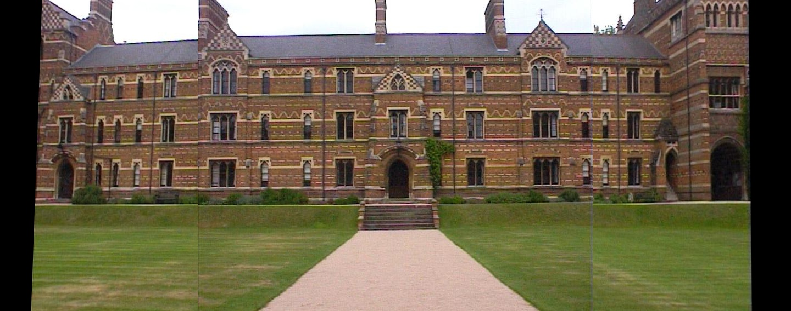

# Image Stitching for Panoramic Images
Creating Panorama images from 3 separate images using Image Stitching by implementing Harris Corners feature detection and Angle-based feature matching to estimate Homography transformations using the center image as the reference frame.

# Requirements
1. python == 3.7.4
2. numpy == 1.16.5
3. openCV == 3.4.2
4. matplotlib == 3.1.1
---
### Input Images
Left image                      | Center Image                    | Right Image
:------------------------------:|:-------------------------------:|:-------------------------------:
 |  | 

### Output Panorama Image

# Instructions
---
Coming soon...

