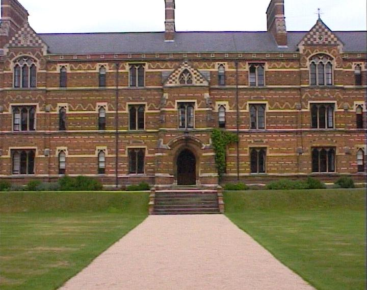

# image-stitching
Creating Panorama images from 3 separate images using Image Stitching

# Requirements
1. python == 3.7.4
2. numpy == 1.16.5
3. openCV == 3.4.2
4. matplotlib == 3.1.1
---
# Input Images

